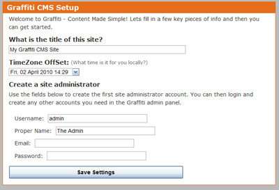
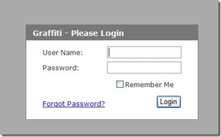

# System Requirements for Graffiti

Ensure your system is set up to support Graffiti.

Your system must meet the following requirements before you install Graffiti.
* You (or your web host) must be using one of the following operating systems: **Windows 2000 Pro, Windows 2000/2003/2008 Server, Windows XP Pro, or any version of Windows Vista or Windows 7 that is Home Premium or above**.
* **Internet Information Services** (IIS) is installed on your computer or server if your Web site will be hosted on a web server. If you are installing Graffiti on a local server, you do not need to install IIS.

_The IIS installation procedure provides you with information for configuring IIS for Graffiti, but not how to install IIS. You can find out about IIS by going to the following Web site:_
_[Installing IIS](https://www.iis.net/learn/install)_

* .NET Framework Version 3.5 is installed and enabled on your computer or server.

# Configuring Internet Information Services for Graffiti

Learn how to configure IIS to support Graffiti.

If your Web site is hosted by your local server, IIS is not required for Graffiti.

**Procedure**

1. Access IIS from Start/Settings/Control Panel/Administrative Tools/Internet Information Services. The Internet Information Services window displays. 
2. In the left panel, navigate to the Default Web Site folder. 
3. Right-click on the folder and select Properties to display the Default Web Site Properties window.
4. On the Documents tab, click **Add**. The Add Default Document window displays. 
5. Type _default.aspx_ in the text field.
6. Click **OK**.
7. Click **Apply** on the Documents tab to save the setting.
8. On the Home Directory tab, ensure the local path is correct. 
9. If you have not saved your settings, click **Apply** on the Default Web Site Properties window, then close out by clicking **OK**. You will return to the Internet Information Services window.
10. In the left panel, navigate to Web Sites/Default Web Sites/Graffiti (or the folder you specified during installation.
11. Right click on the Graffiti folder and select Properties to display the properties window.
12. From the Directory tab, click **Create**. The Application Name text field automatically populates and the Create button changes to **Remove**.
13. Go to Start/Run and type the following path to register ASPNET: `C:\WINDOWS\Microsoft.NET\Framework\v2.0.50727\aspnet_regiis.exe –i`.

_Your system automatically opens a DOS command window. When registration is complete, the DOS command window closes automatically._

# Installing Graffiti

To run an ASP.Net application locally, you need to have access to a database server and Internet Information Services (Microsoft's web server software). Developers will usually have both of these tools installed, but designers and more casual users may not.

**Procedure**

1. Ensure your server meets the system requirements for installing Graffiti.
2. Download the latest release of Graffiti from [http://graffiticms.codeplex.com/releases/](http://graffiticms.codeplex.com/releases/)
3. Extract the files to a folder on your computer. You can FTP them to your server or load them directly onto your computer.
4. After the extraction process is complete, navigate to the parent folder into which you extracted the files. Along with a number of files, Graffiti extracts two folders – Web and Data – and loads them into the parent folder.
5. Select the child Web folder and copy it and its contents to your Web site folder or virtual directory. This is the root location of your web files. It could be your own server, a shared server, etc. If you have a hosting account, your provider should have given you a location to put your Web files.
6. You will need to select a database to use with Graffiti and configure it. See [[Configuring A New Database|Configuring A New Database]] for instructions. You will also need to configure a database connection by making some changes to the web.config file. See About the Graffiti Database for details.

7. In your web browser, navigate to site url. You will be forwarded automatically to the setup page. Set the site title, time zone, and admin user account email and password before continuing.

8. You will be forwarded to _/graffiti-admin/_ to access the login page.

_When you login for the first time, the dashboard will be empty because there is no content in the database._

# Configuring Server Permissions for Graffiti
# About the Graffiti Database
# Graffiti Fundamentals
# Dashboard
# Reports
# Setting Security Properties for Graffiti
# Understanding Roles and Permissions